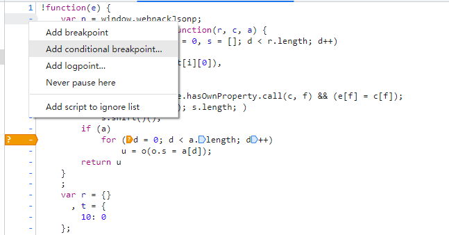
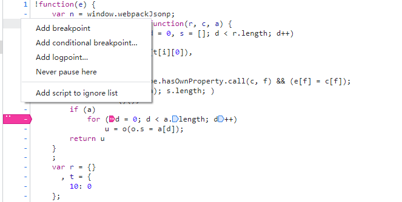

# 前端 JS 安全对抗原理与实践

原文链接：https://mp.weixin.qq.com/s/FSlc676u8d61rRn3jSGY_w

## 1 概念解析

### 1.1 什么是接口加密

如今这个时代，数据已经变得越来越重要，网页和APP是主流的数据载体，如果获取数据的接口没有设置任何的保护措施的话，数据就会被轻易地窃取或篡改。

除了数据泄露外，一些重要功能的接口如果没有做好保护措施也会被恶意调用总成DDoS、条件竞争等攻击效果，比如以下几个场景：

、

一些营销活动类的 Web 页面，领红包，领劵，投票，抽奖等活动方式很常见。此类活动对于普通用户来说应该是“拼手气”，而对于非正常用户来说，可以通过直接刷活动 API 接口的这种“作弊”方式来提升“手气”。这样对普通用户来说很不公平。


所以对重要接口都会采用加密验签的方式进行保护，而验签的加密逻辑大多说都通过 JS 代码实现，所以保护 JS 代码不被攻击着窃取尤为重要。


### 1.2 为什么要保护 JS 代码


> + JavaScript 代码运行于客户端
> + JavaScript 代码是公开透明的

由于这两个原因，致使 JavaScript 代码是不安全的，任何人都可以读、分析、复制、盗用甚至篡改。


### 1.3 应用场景

以下场景就通过特定的防护措施提高了攻击成本：

> + 某些网站会在页面使用 JavaScript 对数据进行加密，以保护数据的安全性和隐私性，在爬取时需要通过解密 JavaScript 代码才能获取到数据。
> + 某些网站的 URL 会有某个参数带有一些不太懂的长串加密参数，攻击者要爬取的话就必须要知道这些参数是怎么构造的，否则无法正确的访问该 URL。
> + 翻看网站的 JavaScript 源代码，可以发现很多压缩了或者看不太懂的字符，比如 JavaScript 文件名被编码，JavaScript 的文件内容都压缩成几行，JavaScript 变量也被修改成单个字符或者一些十六进制的字符，所以我们不能轻易的根据 JavaScript 找出某些接口的加密逻辑。


### 1.4 涉及的技术

这些场景都是网站为了保护数据不被轻易抓取采取的措施，运用的技术主要有：

> + 接口加密技术
> + JavaScript 压缩、混淆和加密技术


## 技术原理

### 2.1 接口加密技术

数据和功能一般是通过服务器提供的接口来实现，为了提升接口安全性，客户端会和服务端约定一种接口检验方式，通常是各种加密和编码算法，如Base64、Hex、MD5、AES、DES、RSA等。

常见的数据接口都会携带-个 sign 参数用于权限管控：

> 1. 客户端和服务端约定一种接口校验逻辑，客户端在每次请求服务端接口的时候会附带一个 sign 参数。
> 2. sign 参数的逻辑自定义，可以由当前时间戳、设备ID、日期、双方约定好的秘钥经过一些加密算法构成。
> 3. 客户端根据约定的加密算法构成 sign，每次请求服务器的时候附带上 sign 数。
> 4. 服务器根据约定的加密算法和请求的数据对 sign 进行校验，如果校验通过，才返回数据，否则拒绝响应。


这就是一个比较简单的接口参数加密的实现，如果有人想要调用这个接口的话，必须要破解 sign 的生成逻辑，否则是无法正常调用接口的。

当然上面的实现思路比较简单，还可以增加一些时间戳信息和访问频次来增加时效性判断，或使用非对称加密提高加密的复杂程度。

实现接口参数加密需要用到一些加密算法，客户端和服务端都有对应的 SDK 来实现这些加密算法，如 JavaScript 的 crypto-js、Python 的 hashlib、Crypto 等等。如果是网页且客户端的加密逻辑是用 JavaScript 来实现的话，其源代码对用户是完全可见，所以我们需要用压缩、混淆、加密的方式来对 JavaScript 代码进行一定程度的保护。

### 2.2 什么是压缩

去除 JavaScript 代码中不必要的空格、换行等内容，是源码都压缩为几行内容，降低代码可读性，同时可提高网站的加载速度。

如果仅仅是去除空格换行这样的压缩方式，几乎没有任何防护作用，这种压缩方式仅仅是降低了代码的直接可读性，可以用 IDE、在线工具或Chrome 轻松将 JavaScript 代码变得易读。

所以 JavaScript 压缩技术只能在很小的程度上起到防护作用，想提高防护的效果还得依靠 JavaScript 混淆和加密技术。


### 2.3 什么是混淆

使用变量混淆、字符串混淆、属性加密、控制流平坦化、调试保护、多态变异等手段，使代码变得难以阅读和分析，同是不影响代码原有功能，是一种理想且使用的 JS 保护方案。

> + **变量混淆**：将变量名、方法名、常量名随机变为无意义的乱码字符串，降低代码可读性，如转成单个字符串或十六进制字符串。
> + **字符串混淆**：将字符串阵列化集中放置，并进行 MD5 或 Base64 编码存储，使代码中不出现明文字符串，可以避免使用全局搜索字符串的方式定位到入口点。
> + **属性加密**：针对 JavaScript 对象的属性进行加密转化，隐藏代码之间的调用关系，把 key-value 的映射关系混淆掉。
> + **控制流平坦化**：打乱函数原有代码执行流程及函数调用关系，使代码逻辑变得混乱无序。
> + **调用保护**：基于调试器特性，加入一些强制调试 debug 语句，无限 debug、定时 debug、debug 关键字，使其在调试模式下难以顺利执行 JavaScript 代码。
> + **多态变异**：JavaScript 代码每次被调用时，代码自身立刻自动发生变异，变化为与之前完全不同的代码，避免代码被动态分析调试。

### 2.4 什么是加密

JavaScript 加密是对 JavaScript 混淆技术防护的进一步升级，基本思路是将一些核心逻辑用 C/C++ 语言来编写，并通过 JavaScript 调用执行，从而起到二进制级别的防护作用，加密的方式主要有 Emscripten 和 WebAssembly 等。

#### 1 Emscripten

Emscripten 编译器可以将 C/C++ 代码编译成 asm.js 的 JavaScript 变体，再由 JavaScript 调用执行，因此某些 JavaScript 的核心功能可以使用 C/C++ 语言实现。


#### 2 WebAssembly

WebAssembly 也能将 C/C++ 代码转成 JavaScript 引擎可以运行的代码，但转出来的代码是二进制字节码，而 asm.js 是文本，因此运行速度更快、体积更小，得到的字节码具有和 JavaScript 相同的功能，在语法上完全脱离 JavaScript，同时具有沙盒化的执行环境，利用 WebAssembly 技术，可以将一些核心的功能用 C/C++ 语言实现，形成浏览器字节码的形式，然后在 JavaScript 中通过类似如下的方式调用：


这种加密方式更加安全，想要逆向或破解需要逆向 WebAssembly，难度极大。

### 2.5 工具介绍

#### 2.5.1 压缩混淆工具

> + **Uglifyjs**(开源)
  >  用 NodeJS 编写的 JavaScript 压缩工具，是目前最流行的 JS 压缩工具，JQuery 就是使用此工具压缩，UglifyJS 压缩率高，压缩选项多，并且具有优化代码，格式化代码功能。
> + **jshaman**：
  > jshaman 是一个商业级工具，看了很多社区的评论，这个目前是最好的，可以在线免费使用，也可以购买商业版。
> + **jsfuck**：
  > 开源的 js 混淆工具，原理比较简单，通过特定的字符串加上下标定位字符，再由这些字符替换源代码，从而实现混淆。
> + **YUI Compressor**：
  > 业界巨头 yahoo 提供的一个前端压缩工具，通过 java 库编译 css 或 js 文件进行压缩

#### 2.5.2 反混淆工具

> + **jsbeautifier**：
  > jsbeautifier 是一个为前端开发人员制作的 Chrome 扩展，能够直接查看经过压缩的 Javascript 代码。
> + **UnuglifyJS**：
  > 压缩工具uglify对应的解混淆工具。
> + **jspacker**：
  > 用PHP编写的压缩工具，可以混淆代码保护知识产权，产生的代码兼容 IE、FireFox 等常用浏览器，国内大部分在线工具网站都采用这种算法压缩。

## 3 前端安全对抗

### 3.1 前端调试方法

#### 3.1.1 Elements

Elements 面板会显示当前网页中的 DOM、CSS 状态。且可以修改页面上的 DOM 和 CSS，即时看到结果，省去了在编辑器修改、储存、浏览器查看结果的流程。

有时候一些 DOM 节点会嵌套很深，导致我们很难利用 Elements 面板 HTML 代码来找到对应的节点。inspect(DOM 元素)可以让我们快速跳转到对应的 DOM 节点的 HTML 代码上。


#### 3.1.1 Console

Console 对象提供了浏览器控制台调试的接口，Console 是个对象，上面有很多方便的方法。例如：

> + **console.log( )**：最常用的语句，可以将变量输出到浏览器的控制台中，方便开发者调用JS代码
> + **console.table( )**：可用于打印 obj/arr 成表格
> + **console.trace( )**：可用于 debugger 堆栈调试，方便查看代码的执行逻辑，看一些库的源码
> + **console.count( )**：打印标签被执行了几次，预设值是 default，可用在快速计数
> + **console.group( )/console.groupEnd( )**：为了方便一眼看到自己的 log，可以用 console.group 自定义 message group 标签，还可以多层嵌套，并用 console.groupEnd 来关闭 Group。

#### 3.1.3 JS 断点调试

JS 断点调试，即在浏览器开发者工具中为 JS 代码添加断点，让 JS 执行到某个特定位置停住，方便开发者对该处代码段进行分析与逻辑处理。

##### Sources 面板

###### ① 普通断点（breakpoint）

给一段代码添加断点的流程是："F12（Ctrl + Shift + I）打开开发工具"->"点击Sources菜单"->"左侧树中找到相应文件"→"点击行号列"即完成在当前行添加/删除断点操作。当断点添加完毕后，刷新页面JS执行到断点位置停住，在 Sources 界面会看到当前作用域中所有变量和值。


> + **恢复（Resume**）： 恢复按钮(第一个按钮)，继续执行，快捷键 F8，继续执行，如果没有其他的断点，那么程序就会继续执行，并且调试器不会再控制程序。
> + **跨步（Step over）**：运行下一条指令，但不会进入到一个函数中，快捷键 F10。
> + **步入（Step into）**：快捷键 F11，和“下一步（Step）”类似，但在异步函数调用情况下表现不同，步入会进入到代码中并等待异步函数执行。
> + **步出（Step out）**：继续执行到当前函数的末尾，快捷键 Shift+F11，继续执行代码并停止在当前函数的最后一行，当我们使用偶然地进入到一个嵌套调用，但是我们又对这个函数不感兴趣时，我们想要尽可能的继续执行到最后的时候是非常方便的。
> + **下一步（Step）**：运行下一条语句，快捷键 F9，一次接一次地点击此按钮，整个脚本的所有语句会被逐个执行，下一步命令会忽略异步行为。


启用/禁用所有的断点：这个按钮不会影响程序的执行。只是一个批量操作断点的开/关。

> + **察看（Watch）**：显示任意表达式的当前值
> + **调用栈（Call Stack）**：显示嵌套的调用链
> + **作用域（Scope）**：显示当前的变量
> + **Local**：显示当前函数中的变量
> + **Global**：显示全局变量

###### ② 条件断点（Conditional breakpoint）

给断点添加条件，只有符合条件时，才会触发端点，条件断点颜色是橙色



###### ③ 日志断点（logpoint）

当代码执行到这里时，会在控制台输出你的表达式，不会暂停代码执行，日志断点的颜色是粉红色。



##### debugger 命令

通过在代码中添加 "debugger;" 语句，当代码执行到该语句的时候就会自动断点，之后的操作和在 Sources 面板添加断点调试，唯一的区别在于调试完后需要删除该语句。

在开发中偶尔会遇到异步加载 html 片段（包含内嵌JS代码）的情况，而这部分 JS 代码在 Sources 树中无法找到，因此无法直接在开发工具中直接添加断点，那么如果想给异步加载的脚本添加断点，此时 "debugger;" 就发挥作用了。

### 3.2 反调试手段

#### 3.2.1 禁用开发者工具

监听是否打开开发者工具，若打开，则直接调用JavaScript的window.close( )方法关闭网页

① 监听 F12 按键、监听 Ctrl+Shift+I（Windows系统）组合键、监听右键菜单，监听 Ctrl+s 禁止保存至本地，避免被 Overrides。

```html
<script>
 
    //监听F12、Ctrl+Shift+i、Ctrl+s
    document.onkeydown = function (event) {
        if (event.key === "F12") {
            window.close();
            window.location = "about:blank";
        } else if (event.ctrlKey && event.shiftKey && event.key === "I") {//此处I必须大写
            window.close();
            window.location = "about:blank";
        } else if (event.ctrlKey && event.key === "s") {//此处s必须小写
            event.preventDefault();
            window.close();
            window.location = "about:blank";
        }
 
    };
 
    //监听右键菜单
    document.oncontextmenu = function () {
        window.close();
        window.location = "about:blank";
    };
</script>
```

② 监听窗口大小变化

```html
<script>
 
    var h = window.innerHeight, w = window.innerWidth;
    window.onresize = function () {
        if (h !== window.innerHeight || w !== window.innerWidth) {
            window.close();
            window.location = "about:blank";
        }
    }
</script>
```

③ 利用Console.log

```html
<script>
 
    //控制台打开的时候回调方法
    function consoleOpenCallback(){
        window.close();
        window.location = "about:blank";
        return "";
    }
 
    //立即运行函数，用来检测控制台是否打开
    !function () {
        // 创建一个对象
        let foo = /./;
        // 将其打印到控制台上，实际上是一个指针
        console.log(foo);
        // 要在第一次打印完之后再重写toString方法
        foo.toString = consoleOpenCallback;
    }()
</script>
```

#### 3.2.2 无限debugger反调试

① constructor

```html
<script>
 
    function consoleOpenCallback() {
        window.close();
        window.location = "about:blank";
    }
 
    setInterval(function () {
        const before = new Date();
        (function(){}).constructor("debugger")();
        // debugger;
        const after = new Date();
        const cost = after.getTime() - before.getTime();
        if (cost > 100) {
            consoleOpenCallback();
        }
    }, 1000);
</script>
```

② Function

```html
<script>
    setInterval(function () {
        const before = new Date();
        (function (a) {
            return (function (a) {
                return (Function('Function(arguments[0]+"' + a + '")()'))
            })(a)
        })('bugger')('de');
 
        // Function('debugger')();
 
        // debugger;
        const after = new Date();
        const cost = after.getTime() - before.getTime();
        if (cost > 100) {
            consoleOpenCallback2();
        }
 
    }, 1000);
</script>
```

### 3.3 反反调试手段

#### 3.3.1 破解禁用开发者工具

针对判断是否打开开发者工具的破解方式很简单，只需两步就可以搞定。

> + 将开发者工具以独立窗口形式打开
> + 打开开发者工具后再打开网址

#### 3.3.2 无限 debugger 反调试

针对无限 debugger 反调试，有以下破解方法

① 直接使用 dubbger 指令的，可以在 Chrome 找到对应行（格式化后），右键行号，选择 Never pause here 即可。

② 使用了 constructor 构造 debugger 的，只需在 console 中输入以下代码后，点击 F8（Resume script execution）回复 js 代码执行即可（直接点击小的蓝色放行按钮即可）。

```javascript
Function.prototype.constructor=function(){}
```

③ 使用了 Function 构造 debugger 的，只需在 console 中输入以下代码。

```javascript
Function = function () {}
```

### 3.4 总结

JavaScript 混淆加密使得代码更难以被反编译和分析，从而提高了代码的安全性，攻击者需要花费更多时间和精力才能理解和分析代码，从而降低了攻击者入侵的成功率，但它并不能完全保护代码不被反编译和分析，如果攻击者有足够的的时间和资源，他们仍然可以理解代码并找到其中的漏洞，道高一尺魔高一丈，任何客户端加密混淆都会被破解，只要用心都能解决，我们能做的就是拖延被破解的时间，所以尽量避免在前端代码中嵌入敏感信息或业务逻辑。
